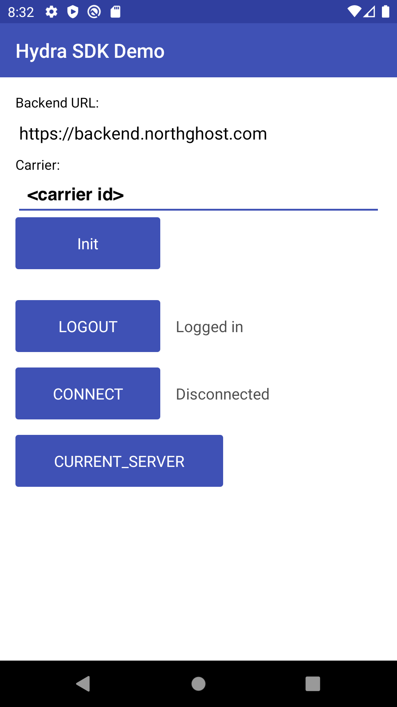

GitHub project: https://github.com/AnchorFreePartner/hydrasdk-demo-android

# Anchorfree Hydra VPN SDK demo for Android
This is a demo application for Android with basic usage of Hydra VPN SDK.

# Compatibility

Minimum Android SDK version 15

# Setup

1. Clone app source code locally
2. Import project in Android Studio
3. Register an account at [developer.anchorfree.com](https://developer.anchorfree.com)
4. Create a project

5. Add locations

6. Put the **project_id** from dashboard to the app

7. Click "Init"
8. Click "Login"
9. Click "Connect"

# Documentation

Full SDK documentation available [here](https://developer.anchorfree.com/#docs/all/unify_sdk_hydra__openvpn_for_android)

